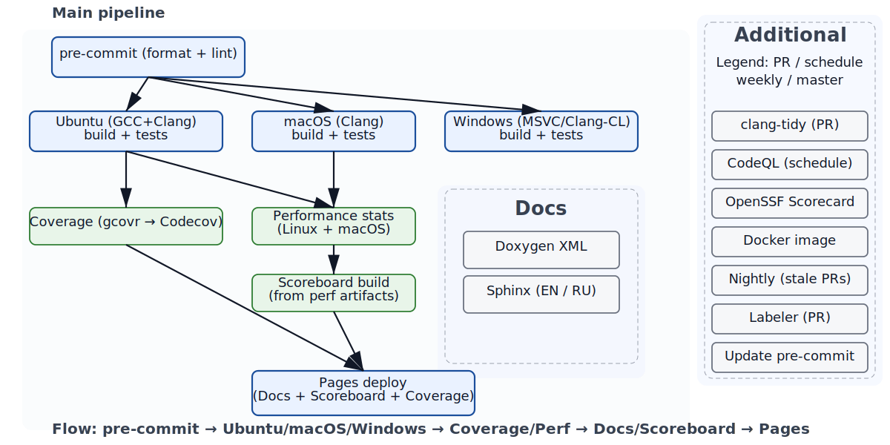

Continuous Integration (CI)
============================

Students need to pass all the checks in the CI pipeline before their work can be considered for submission.
This includes successful code checkout, build ans testing stages.
Each integration is verified by an automated build and automated tests.

CI Pipeline
------------

The CI pipeline for this project is illustrated in the following diagram:

