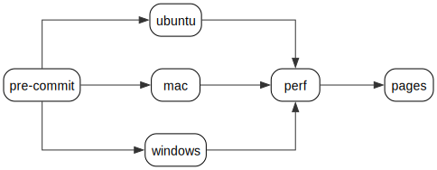

Continuous Integration (CI)
===========================

Overview
--------
Your pull request must pass all required CI checks before review/merge. The pipeline validates formatting and static analysis, builds on all platforms, runs functional tests (threads, MPI, and OSH on Linux), measures performance, builds docs, and publishes artifacts (coverage report, docs, scoreboard).

High‑level pipeline
-------------------

- Pre-commit checks (fast) — runs repository hooks on changed files; fix locally via ``pre-commit run -a``.

- Platform builds and tests (Ubuntu, macOS, Windows) — Ubuntu (GCC/Clang), macOS (Clang), Windows (MSVC/Clang‑CL); functional tests via ``scripts/run_tests.py`` for threads (``--counts 1 2 3 4``; extended ``5 7 11 13``) and processes (MPI/OSH on Linux, MPI on macOS/Windows, ``--counts 1 2 3 4``).

- Sanitizers (Ubuntu/Clang) — Address/UB/Leak; tests use ``PPC_ASAN_RUN=1`` to skip valgrind.

- Coverage (Ubuntu/GCC) — ``-D USE_COVERAGE=ON`` + gcovr; publishes to Codecov and uploads ``cov-report`` (HTML).

- Performance (perf) — ``scripts/run_tests.py --running-type=performance`` writes benchmark data to ``build/perf_stat_dir``; uploads ``perf-stat`` (Linux) and ``perf-stat-macos`` (macOS).

- Pages (docs and scoreboard) — builds Doxygen XML and Sphinx (EN+RU) + scoreboard; on ``master`` deploys with coverage to GitHub Pages.

- Security and static analysis — clang‑tidy on PRs (avoid ``NOLINT``/``IWYU pragma``), task backend API checks, scheduled CodeQL (C++/Python) and OpenSSF Scorecard.

Diagram
-------
The pipeline is illustrated below. Image is auto-generated by ``scripts/jobs_graph.py``:

Running tests locally
---------------------

Use the ``scripts/run_tests.py`` helper. Common environment variables:

``PPC_NUM_THREADS``
    Number of threads (also exported as ``OMP_NUM_THREADS``).

``PPC_NUM_PROC``
    Number of MPI processes or OSH processing elements to launch.

``PPC_ASAN_RUN``
    Set to ``1`` when sanitizers are enabled to skip ``valgrind`` runs (default ``0``).

``PPC_IGNORE_TEST_TIME_LIMIT``
    Set to ``1`` to disable test time limits (default ``0``).

Execution modes:
- ``--running-type=threads`` — shared-memory backends (OpenMP/TBB/std::thread)
- ``--running-type=processes`` — MPI tests, plus OSH tests on Linux
- ``--running-type=performance`` — performance benchmarks (mirrors CI perf job)

Examples:

.. code-block:: bash

   export PPC_NUM_THREADS=4
   export PPC_NUM_PROC=2

   # Threads (functional)
   scripts/run_tests.py --running-type=threads --counts 1 2 4

   # MPI and OSH (functional)
   scripts/run_tests.py --running-type=processes --counts 2 4

   # OSH only, direct launcher form on Linux
   ./build/ppc_openmpi/install/bin/oshrun -np 2 ./build/bin/ppc_func_tests --gtest_filter="*_osh_*:*OSHEnabled*"

   # Performance (benchmarks)
   scripts/run_tests.py --running-type=performance

Options:
- ``--counts`` runs tests for multiple thread/process counts sequentially.
- ``--additional-mpi-args`` passes extra launcher flags (e.g., ``--oversubscribe``).
- ``--verbose`` prints every executed command.

Coverage and sanitizers locally
-------------------------------
- Sanitizers (Linux): configure with ``-D ENABLE_ADDRESS_SANITIZER=ON`` (and optional UB/Leak), run tests with ``PPC_ASAN_RUN=1``.
- Coverage (Linux/GCC): configure with ``-D USE_COVERAGE=ON``, run tests, then generate HTML via ``gcovr`` (see CI ``gcc-build-codecov`` for command line).

Docs and scoreboard artifacts
-----------------------------
- Docs: run Doxygen first (``doxygen Doxyfile``), then Sphinx EN/RU via CMake targets ``docs_gettext``, ``docs_update``, ``docs_html``.
- Scoreboard: generate perf stats (``scripts/run_tests.py --running-type=performance``) and build scoreboard target or use ``python3 scoreboard/main.py`` locally.

Troubleshooting
---------------
- Pre-commit fails: run ``pre-commit run -a`` locally (install with ``pre-commit install``) and commit fixes.
- Static analysis fails: address clang-tidy comments; do not use ``NOLINT``/``IWYU pragma`` in task code; keep OpenMP/TBB/MPI/OSH/std::thread APIs in their matching task backend directories.
- Tests not found/not running: verify ``settings.json`` enables required technologies and tests exist; see :doc:`submit_work`.
- Time limits exceeded: reduce data sizes; prefer env vars (:doc:`environment_variables`) like ``PPC_TASK_MAX_TIME``/``PPC_PERF_MAX_TIME``; avoid sleeps/randomness.
- MPI runs fail locally: set ``PPC_NUM_PROC`` and try ``--additional-mpi-args=\"--oversubscribe\"``.
- OSH runs fail locally: verify submodules are initialized and ``build/ppc_openmpi/install/bin/oshrun`` exists.
- Docs build fails: fix RST warnings; run ``doxygen Doxyfile`` before Sphinx targets.
- Performance job fails: ensure performance tests are enabled and keep durations within limits.

Local clang-tidy and gcovr examples
-----------------------------------

clang-tidy (static analysis):

.. code-block:: bash

   # Configure with compile_commands.json
   cmake -S . -B build -G Ninja -D CMAKE_BUILD_TYPE=Release -D CMAKE_EXPORT_COMPILE_COMMANDS=ON
   cmake --build build --parallel

   # clang-tidy run:
   ### analyze all sources
   run-clang-tidy -p build
   ### apply available automatic fixes
   run-clang-tidy -p build -fix

gcovr (coverage, GCC):

.. code-block:: bash

   # Configure with coverage flags (use GCC)
   cmake -S . -B build -G Ninja -D USE_COVERAGE=ON -D CMAKE_BUILD_TYPE=Release
   cmake --build build --parallel

   # Run tests here (threads/processes/performance)
   scripts/run_tests.py --running-type=threads --counts 1 2 4

   # Generate reports (install gcovr if needed: python3 -m pip install gcovr)
   mkdir -p cov-report
   (cd build && gcovr --gcov-executable "$(which gcov)" \
         -r ../ \
         --exclude '.*3rdparty/.*' \
         --exclude '/usr/.*' \
         --exclude '.*tasks/.*/tests/.*' \
         --exclude '.*modules/.*/tests/.*' \
         --exclude '.*tasks/common/runners/.*' \
         --exclude '.*modules/runners/.*' \
         --exclude '.*modules/util/include/perf_test_util.hpp' \
         --exclude '.*modules/util/include/func_test_util.hpp' \
         --exclude '.*modules/util/src/func_test_util.cpp' \
         --xml --output ../coverage.xml \
         --html=../cov-report/index.html --html-details)

Tooling tips (versions and install)
-----------------------------------

- clang-tidy version
  - CI uses clang-tidy 22. Prefer the same locally to avoid mismatches.
  - The helper may be named ``clang-tidy-22`` or ``run-clang-tidy-22`` on some systems.

- Linux
  - clang-tidy: install from your distro (e.g., ``apt install clang-tidy-22``) or use the course Docker image.
  - gcovr: ``python3 -m pip install gcovr`` or a distro package.
  - GCC version: use ``gcov-14`` when building with GCC 14 (as in CI).

- macOS
  - clang-tidy: ``brew install llvm``; binary at ``$(brew --prefix)/opt/llvm/bin/clang-tidy``.
  - Optionally add LLVM to PATH or invoke with full path.
  - gcovr: ``python3 -m pip install gcovr`` or ``brew install gcovr``.

- Windows
  - clang-tidy: install LLVM (Clang) or use ``choco install llvm``; ensure ``clang-tidy.exe`` is in PATH.
  - gcovr: ``py -m pip install gcovr``.
  - Coverage is primarily supported in our CI on Linux/GCC; prefer generating reports on Linux.
